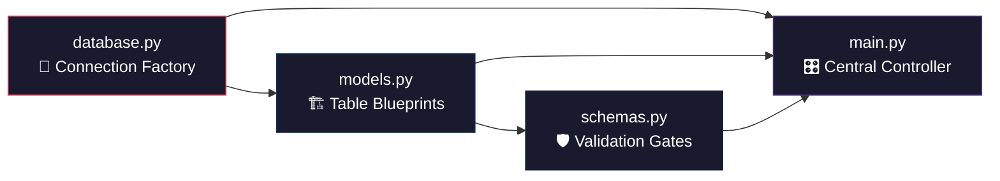
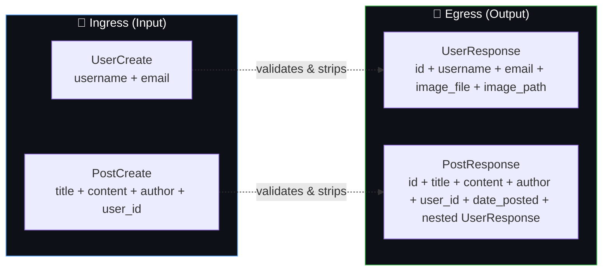

# 🔬 FastAPI Blog — Holistic Multi-Dimensional Analysis

> A deep-dive dissection of system choreography, data life cycles, user journeys, and cognitive models for the FastAPI Blog application.

---

## Table of Contents

1. [The System Choreography (File-to-File Flows)](#1-the-system-choreography)
2. [The Data Lifecycle (Input-to-Output Transformer)](#2-the-data-lifecycle)
3. [The User-Perspective Journey (Human Experience Flow)](#3-the-user-perspective-journey)
4. [The "Anti-Gravity" Cognitive Synthesis (Cheat Sheet)](#4-the-anti-gravity-cognitive-synthesis)

---

## 1. THE SYSTEM CHOREOGRAPHY

### How the Files Wire Together

Your application is a **four-file pipeline** where each file owns exactly one responsibility. Here is the **exact mechanical chain** of how they connect:



---

### Stage 1 → [database.py](file:///c:/Users/balaj/Pictures/FASTAPI-deep/database.py) — The Foundation Layer

This file does **three atomic things** and nothing else:

| What it Creates | What it Does | Who Consumes It |
|---|---|---|
| `engine` | Opens a raw TCP-like socket to `blog.db` on disk | `main.py` (line 20) uses it to stamp tables into existence |
| `SessionLocal` | A *factory* that produces temporary database conversation windows | `get_db()` uses it to mint fresh sessions per-request |
| `Base` | An empty inheritance anchor class | `models.py` (line 8) extends it so SQLAlchemy treats child classes as table definitions |
| `get_db()` | A **generator function** that opens a session, yields it, then auto-closes it | `main.py` injects it via `Depends(get_db)` into every route |

**The critical detail:** `get_db()` uses a `with` statement + `yield`. This means:
1. When a request arrives → a fresh `SessionLocal()` database session is born.
2. The session is handed to the route function via dependency injection.
3. When the route finishes (success *or* crash) → the `with` block auto-closes and releases the database connection.

This is a **context-managed lifecycle** — the route function never has to worry about forgetting to close the connection.

```python
# database.py — The Mechanical Truth
def get_db():
    with SessionLocal() as db:  # ← Opens connection
        yield db                # ← Hands it to the route, then WAITS
    # ← When route finishes, this line executes: connection auto-closes
```

---

### Stage 2 → [models.py](file:///c:/Users/balaj/Pictures/FASTAPI-deep/models.py) — The Structural Blueprints

This file **imports `Base` from `database.py`** (line 8) and uses it as a parent class. Every class that inherits from `Base` becomes a **table definition** that SQLAlchemy knows how to translate into real SQL `CREATE TABLE` statements.

#### The Two Tables

**`User` table** (lines 11–30):

| Column | SQL Type | Constraints | Purpose |
|---|---|---|---|
| `id` | `INTEGER` | Primary Key, Indexed | Unique row identifier |
| `username` | `VARCHAR(50)` | Unique, Not Null | Login handle |
| `email` | `VARCHAR(120)` | Unique, Not Null | Contact address |
| `image_file` | `VARCHAR(200)` | Nullable, Default: `None` | Custom avatar filename |

Plus a **computed property** `image_path` (line 26–30) — this is *not* a database column. It's a Python-only property that dynamically returns either `/media/profile_pics/{filename}` or a hardcoded fallback `/static/profile_pics/default.jpg`.

**`Post` table** (lines 33–49):

| Column | SQL Type | Constraints | Purpose |
|---|---|---|---|
| `id` | `INTEGER` | Primary Key, Indexed | Unique row identifier |
| `title` | `VARCHAR(100)` | Not Null | Blog post headline |
| `content` | `TEXT` | Not Null | Full post body |
| `user_id` | `INTEGER` | Foreign Key → `users.id`, Indexed | Links post to its author |
| `date_posted` | `DATETIME(tz)` | Default: `datetime.now(UTC)` | Auto-stamped creation time |

#### The Relationship Wiring

```python
# In User:
posts: Mapped[list[Post]] = relationship(back_populates="author")

# In Post:
author: Mapped[User] = relationship(back_populates="posts")
```

This creates a **bidirectional bridge**:
- From a `User` object → you can access `user.posts` to get a list of all their blog posts.
- From a `Post` object → you can access `post.author` to get the full `User` object who wrote it.

SQLAlchemy does **lazy loading** — it only fires the secondary SQL query when you actually *touch* `.author` or `.posts` in your code.

---

### Stage 3 → [schemas.py](file:///c:/Users/balaj/Pictures/FASTAPI-deep/schemas.py) — The Validation Gateway

Schemas sit **between the outside world and your database models**. They are Pydantic classes that serve as **security checkpoints** — they validate incoming data and filter outgoing data.



**The Inheritance Chain:**

| Schema | Inherits From | Fields | Role |
|---|---|---|---|
| `UserBase` | `BaseModel` | `username`, `email` | Shared foundation for all User schemas |
| `UserCreate` | `UserBase` | *(inherits all)* | Ingress gate — what the client must send to create a user |
| `UserResponse` | `UserBase` | + `id`, `image_file`, `image_path` | Egress filter — what the client receives back |
| `PostBase` | `BaseModel` | `title`, `content`, `author` | Shared foundation for all Post schemas |
| `PostCreate` | `PostBase` | + `user_id` | Ingress gate — what the client must send to create a post |
| `PostResponse` | `PostBase` | + `id`, `user_id`, `date_posted`, `author: UserResponse` | Egress filter — enriched output with nested author object |

**Key mechanism — `from_attributes = True`:**

Both `UserResponse` and `PostResponse` have `model_config = ConfigDict(from_attributes=True)`. This tells Pydantic: *"Don't expect a dictionary — I'm going to hand you a raw SQLAlchemy ORM object. Read its Python attributes directly (including computed `@property` methods like `image_path`)."*

Without this flag, Pydantic would crash because ORM objects aren't dictionaries.

---

### Stage 4 → [main.py](file:///c:/Users/balaj/Pictures/FASTAPI-deep/main.py) — The Central Orchestrator

This file **imports everything** and wires it into a running HTTP application. Here's the exact import map:

```text
main.py imports:
├── from database  → Base, engine, get_db
├── from schemas   → PostCreate, PostResponse, UserCreate, UserResponse
├── import models  → models.User, models.Post
├── from fastapi   → FastAPI, Request, HTTPException, status, Depends
├── from sqlalchemy → select, Session
└── from templates → Jinja2Templates("templates/")
```

**Line 20: `Base.metadata.create_all(bind=engine)`**

This is the **genesis command**. It reads every class that inherited from `Base` (i.e., `User` and `Post` from models.py), introspects their column definitions, and executes `CREATE TABLE IF NOT EXISTS` SQL statements against `blog.db`. This is why your database tables exist.

**The Dependency Injection Pattern:**

Every route that needs database access declares `db: Annotated[Session, Depends(get_db)]`. FastAPI sees the `Depends(get_db)` marker and:
1. Calls `get_db()` automatically before executing the route.
2. Passes the yielded `Session` object as the `db` parameter.
3. After the route returns, resumes the generator which triggers the `with` block's cleanup.

**The Dual-Layer Architecture:**

| Path Prefix | Output Format | Exception Handler Behavior |
|---|---|---|
| `/` (no prefix) | HTML via `templates.TemplateResponse()` | Renders `error.html` template |
| `/api/...` | JSON via `response_model` + automatic serialization | Returns raw `JSONResponse` |

The global exception handlers (lines 54–98) inspect `request.url.path.startswith("/api")` to decide which format to use. This single `if` check is what makes your app a **true hybrid** — one codebase serving both humans and machines.

---

## 2. THE DATA LIFECYCLE

### Tracing a "Create Post" Request End-to-End

We'll track the creation of a single blog post from the moment raw bytes leave a client to the moment a formatted JSON response arrives back. The route is `POST /api/posts` ([main.py:235–256](file:///c:/Users/balaj/Pictures/FASTAPI-deep/main.py#L235-L256)).

---

#### Station 0: The Raw HTTP Request

A client (Swagger UI, Postman, or a frontend app) sends:

```http
POST /api/posts HTTP/1.1
Content-Type: application/json

{
  "title": "My First Blog Post",
  "content": "Hello world, this is my very first entry!",
  "author": "balaji",
  "user_id": 1
}
```

At this point, the data is a **raw UTF-8 byte stream** traveling over TCP. FastAPI's ASGI server (Uvicorn) receives it and hands the raw bytes to FastAPI's request parser.

---

#### Station 1: Pydantic Ingress Validation (`PostCreate` Schema)

FastAPI sees the route signature: `def create_post(post: PostCreate, ...)` and knows it must parse the request body into a `PostCreate` instance.

**What happens mechanically:**

```python
# schemas.py — PostCreate inherits from PostBase
class PostBase(BaseModel):
    title: str = Field(min_length=1, max_length=100)    # ← GATE: must be 1-100 chars
    content: str = Field(min_length=1)                    # ← GATE: cannot be empty
    author: str = Field(min_length=1, max_length=50)      # ← GATE: must be 1-50 chars

class PostCreate(PostBase):
    user_id: int                                          # ← GATE: must be an integer
```

**Validation checks executed (in order):**

| # | Check | What Happens on Failure |
|---|---|---|
| 1 | Is the body valid JSON? | `422` — malformed JSON |
| 2 | Does `title` exist and is it a string? | `422` — field required / wrong type |
| 3 | Is `title` between 1–100 characters? | `422` — string too short / too long |
| 4 | Does `content` exist and is it ≥ 1 char? | `422` — field required / too short |
| 5 | Does `author` exist and is it 1–50 chars? | `422` — field required / too short / too long |
| 6 | Does `user_id` exist and is it an integer? | `422` — field required / wrong type |
| 7 | Are there any **extra fields** not defined in the schema? | They are **silently ignored** (Pydantic default behavior) |

If any check fails, Pydantic raises a `RequestValidationError` **before your route code ever executes**. The global exception handler at [main.py:81–98](file:///c:/Users/balaj/Pictures/FASTAPI-deep/main.py#L81-L98) catches it and returns a structured 422 response.

**If all checks pass**, Pydantic produces a clean Python object:

```python
post = PostCreate(
    title="My First Blog Post",
    content="Hello world, this is my very first entry!",
    author="balaji",
    user_id=1
)
```

---

#### Station 2: Business Logic Validation (Route Function)

Now the route function at [main.py:240–256](file:///c:/Users/balaj/Pictures/FASTAPI-deep/main.py#L240-L256) executes:

```python
def create_post(post: PostCreate, db: Annotated[Session, Depends(get_db)]):
    # Step 1: Does user_id=1 actually exist in the users table?
    result = db.execute(select(models.User).where(models.User.id == post.user_id))
    user = result.scalars().first()
    if not user:
        raise HTTPException(status_code=404, detail="User not found")  # ← STOP HERE
```

This is a **semantic validation** that Pydantic cannot do — it requires a live database query. The schema only knows "is this an integer?" but the route knows "does this integer point to a real human being?"

---

#### Station 3: ORM Object Construction

```python
    new_post = models.Post(
        title=post.title,       # "My First Blog Post"
        content=post.content,   # "Hello world, this is my very first entry!"
        user_id=post.user_id,   # 1
    )
```

Notice what is **NOT** passed:
- `id` → The database will auto-generate this (primary key, auto-increment).
- `date_posted` → The model's default `lambda: datetime.now(UTC)` fires automatically.
- `author` (the relationship) → SQLAlchemy will resolve this lazily from `user_id`.

At this moment, `new_post` is a **transient Python object** — it exists only in memory, not in the database.

---

#### Station 4: ORM Session Pipeline (The Three-Step Commit)

```python
    db.add(new_post)       # Step A: "Stage" — tells SQLAlchemy: "track this object"
    db.commit()            # Step B: "Commit" — fires the actual INSERT SQL statement
    db.refresh(new_post)   # Step C: "Refresh" — re-reads the row FROM the database BACK into the object
```

**Why `db.refresh()` matters:**

After `db.commit()`, the `new_post` object has an `id` assigned by SQLite's auto-increment, and `date_posted` has been populated by the default lambda. But the Python object in memory might be *stale* — its attributes might not reflect what the database actually stored. `db.refresh()` forces a `SELECT` query to re-hydrate the object with the database's authoritative values.

After refresh, `new_post` now looks like:

```python
new_post.id = 7                    # ← assigned by database
new_post.title = "My First Blog Post"
new_post.content = "Hello world, this is my very first entry!"
new_post.user_id = 1
new_post.date_posted = datetime(2026, 6, 13, ..., tzinfo=UTC)  # ← auto-generated
new_post.author = <User object>    # ← lazy-loaded when accessed
```

---

#### Station 5: Egress Filtering (`PostResponse` Schema)

The route returns `new_post` (a raw SQLAlchemy ORM object). FastAPI sees `response_model=PostResponse` on the route decorator and triggers Pydantic serialization:

```python
class PostResponse(PostBase):
    model_config = ConfigDict(from_attributes=True)  # ← "read ORM attributes directly"
    
    id: int
    user_id: int
    date_posted: datetime
    author: UserResponse   # ← NESTED! Triggers recursive serialization of the User object
```

**What `PostResponse` includes vs. what it strips:**

| Attribute on ORM Object | Included in Response? | Why? |
|---|---|---|
| `id` | ✅ Yes | Declared in `PostResponse` |
| `title` | ✅ Yes | Inherited from `PostBase` |
| `content` | ✅ Yes | Inherited from `PostBase` |
| `user_id` | ✅ Yes | Declared in `PostResponse` |
| `date_posted` | ✅ Yes | Declared in `PostResponse` |
| `author` | ✅ Yes (as nested `UserResponse`) | Declared as `author: UserResponse` |
| `author.id` | ✅ Yes | Part of `UserResponse` |
| `author.username` | ✅ Yes | Part of `UserResponse` |
| `author.email` | ✅ Yes | Part of `UserResponse` |
| `author.image_file` | ✅ Yes | Part of `UserResponse` |
| `author.image_path` | ✅ Yes | `@property` — `from_attributes=True` reads it |
| `author.posts` | ❌ **Stripped** | NOT in `UserResponse` — prevents infinite recursion |

> [!IMPORTANT]
> Without `response_model`, FastAPI would try to serialize the raw ORM object and likely **expose internal fields** or crash on non-serializable types. The response model acts as a **whitelist filter** — only explicitly declared fields make it into the output.

---

#### Station 6: The Final Serialized JSON Response

FastAPI serializes the Pydantic model to JSON and sends:

```http
HTTP/1.1 201 Created
Content-Type: application/json

{
  "title": "My First Blog Post",
  "content": "Hello world, this is my very first entry!",
  "author": {
    "username": "balaji",
    "email": "balaji@example.com",
    "id": 1,
    "image_file": null,
    "image_path": "/static/profile_pics/default.jpg"
  },
  "id": 7,
  "user_id": 1,
  "date_posted": "2026-06-13T01:21:19+00:00"
}
```

---

#### The Complete Transformation Map

```text
  RAW JSON STRING                     PYDANTIC OBJECT                    ORM OBJECT (in-memory)
  ┌──────────────────┐    validate    ┌──────────────────┐    map       ┌──────────────────┐
  │ {                │ ──────────►   │ PostCreate(      │ ─────────►  │ models.Post(     │
  │   "title": "..." │  (Station 1)  │   title="..."    │ (Station 3) │   title="..."    │
  │   "content":"..."│               │   content="..."  │             │   content="..."  │
  │   "author":"..." │               │   author="..."   │             │   user_id=1      │
  │   "user_id": 1   │               │   user_id=1      │             │   id=None ←      │
  │ }                │               │ )                │             │   date=None ←    │
  └──────────────────┘               └──────────────────┘             └────────┬─────────┘
                                                                               │
                                                                     db.add() + db.commit()
                                                                               │
  FINAL JSON STRING                   PYDANTIC OBJECT                    ORM OBJECT (refreshed)
  ┌──────────────────┐    serialize   ┌──────────────────┐   filter    ┌──────────────────┐
  │ {                │ ◄──────────   │ PostResponse(    │ ◄─────────  │ models.Post(     │
  │   "id": 7        │  (Station 6)  │   id=7           │ (Station 5) │   id=7 ✓         │
  │   "title": "..." │               │   title="..."    │             │   title="..."    │
  │   "date_posted"  │               │   date_posted=.. │             │   date=2026.. ✓  │
  │   "author": {..} │               │   author=User(..)│             │   author=<User>  │
  │ }                │               │ )                │             │   + hidden fields │
  └──────────────────┘               └──────────────────┘             └──────────────────┘
```

---

## 3. THE USER-PERSPECTIVE JOURNEY

### Scenario: A Non-Technical User Creates a Blog Post

---

#### Step 1: The User Opens Swagger UI

The user navigates to `http://localhost:8000/docs` in their browser. They see FastAPI's auto-generated interactive documentation — a clean list of all available API endpoints with expandable cards.

They scroll down and notice the card labeled:

> **POST** `/api/posts` — *Create Post*

They click on it. The card expands to show a "Try it out" button.

---

#### Step 2: The User Fills In the Form

After clicking "Try it out", a JSON text editor appears pre-populated with a template:

```json
{
  "title": "string",
  "content": "string",
  "author": "string",
  "user_id": 0
}
```

The user replaces the placeholders with their actual data and clicks **Execute**.

---

#### Step 3: What Happens When They Make Errors

##### ❌ Error Case 1 — Empty Title

```json
{ "title": "", "content": "Hello!", "author": "balaji", "user_id": 1 }
```

**What they see:**

```
Status: 422 Unprocessable Entity

{
  "detail": [
    {
      "type": "string_too_short",
      "loc": ["body", "title"],
      "msg": "String should have at least 1 character",
      "input": "",
      "ctx": { "min_length": 1 }
    }
  ]
}
```

**What this means in human terms:** *"You left the title blank. It needs at least 1 character."*

##### ❌ Error Case 2 — Non-Existent User ID

```json
{ "title": "My Post", "content": "Hello!", "author": "balaji", "user_id": 999 }
```

**What they see:**

```
Status: 404 Not Found

{ "detail": "User not found" }
```

**What this means:** *"There's no account with ID 999. You need to register first."*

##### ❌ Error Case 3 — Missing Required Field

```json
{ "title": "My Post", "content": "Hello!" }
```

**What they see:**

```
Status: 422 Unprocessable Entity

{
  "detail": [
    { "type": "missing", "loc": ["body", "author"], "msg": "Field required" },
    { "type": "missing", "loc": ["body", "user_id"], "msg": "Field required" }
  ]
}
```

**What this means:** *"You forgot to include the 'author' and 'user_id' fields."*

##### ❌ Error Case 4 — Title Too Long (>100 characters)

```json
{ "title": "AAAA...A (101 chars)", "content": "Hello!", "author": "balaji", "user_id": 1 }
```

**What they see:**

```
Status: 422 Unprocessable Entity

{
  "detail": [
    {
      "type": "string_too_long",
      "loc": ["body", "title"],
      "msg": "String should have at most 100 characters",
      "ctx": { "max_length": 100 }
    }
  ]
}
```

---

#### Step 4: Successful Creation

The user submits valid data. **What they see:**

```
Status: 201 Created
```

A green "201" badge appears in Swagger with the full response body, including the auto-generated `id`, `date_posted`, and the nested `author` object with their profile picture path. The user now knows:
- Their post was saved successfully.
- It was assigned ID `7`.
- The timestamp was recorded automatically.
- Their profile picture path is `/static/profile_pics/default.jpg` (since they haven't uploaded a custom avatar).

---

#### Step 5: The User Visits the Website

The user navigates to `http://localhost:8000/` in their browser and sees the homepage rendered as a styled Bootstrap page via [home.html](file:///c:/Users/balaj/Pictures/FASTAPI-deep/templates/home.html). Their new post appears in the feed with:
- A circular profile picture (the default avatar)
- Their username as a clickable link
- The formatted date ("June 13, 2026")
- The post title as a clickable link
- The post content as a paragraph

Clicking their username takes them to `GET /users/1/posts` — a filtered view of *only* their posts. Clicking the post title takes them to `GET /posts/7` — the full post detail page with Edit/Delete buttons (currently non-functional — marked as TODO).

---

#### The Web UI Error Experience

If the user manually navigates to `http://localhost:8000/posts/99999`:
- The server returns a `404` status code.
- Instead of raw JSON, the user sees the styled [error.html](file:///c:/Users/balaj/Pictures/FASTAPI-deep/templates/error.html) template:

> **Oops... 404 Error**
> Post not found

This is because the global exception handler at [main.py:54–77](file:///c:/Users/balaj/Pictures/FASTAPI-deep/main.py#L54-L77) detects that the URL path does **not** start with `/api`, so it renders the friendly HTML template instead of raw JSON.

---

## 4. THE "ANTI-GRAVITY" COGNITIVE SYNTHESIS

### 🧠 The Cheat Sheet — Zero-Fluff, Maximum Clarity

---

### Mental Model: The Restaurant Kitchen

```text
┌─────────────────────────────────────────────────────────────────────────────┐
│                        🍕 THE FASTAPI RESTAURANT                           │
│                                                                             │
│  FRONT DOOR             HOSTESS            KITCHEN              PANTRY      │
│  (Uvicorn)              (schemas.py)       (main.py)            (database)  │
│                                                                             │
│  Customer walks in ──► "Do you have a    ──► Chef reads the   ──► Stores    │
│  with an order          reservation?         validated order      the dish   │
│  (HTTP request)         Check dress code"    and cooks it         in the     │
│                         (Pydantic            (route function)     fridge     │
│                          validation)                              (SQLite)  │
│                                                                             │
│  Customer receives ◄── Waiter filters   ◄── Kitchen plates    ◄── Fetches  │
│  a plated dish          what goes on          the raw dish        raw        │
│  (JSON response)        the plate             (ORM object)       ingredients│
│                         (response_model)                          (SELECT)  │
└─────────────────────────────────────────────────────────────────────────────┘
```

| Restaurant Role | Code Equivalent | What it Does |
|---|---|---|
| 🚪 Front Door | Uvicorn ASGI Server | Accepts incoming HTTP connections |
| 💁 Hostess | `schemas.py` (Create schemas) | Validates your "order" — rejects bad inputs |
| 👨‍🍳 Chef | `main.py` (route functions) | Processes the request, queries the database |
| 🍳 Kitchen Equipment | `models.py` (ORM models) | The tools and recipes — table definitions |
| 🗄️ Pantry/Fridge | `database.py` + `blog.db` | Raw storage — holds all persistent data |
| 🍽️ Waiter | `schemas.py` (Response schemas) | Filters what the customer sees on the plate |

---

### The Four-File Responsibility Map

```text
╔══════════════════╦═══════════════════════════════════════════════════════════╗
║  FILE            ║  ONE-LINE RESPONSIBILITY                                ║
╠══════════════════╬═══════════════════════════════════════════════════════════╣
║  database.py     ║  "I open and close the warehouse door."                 ║
║  models.py       ║  "I define what the shelves look like inside."          ║
║  schemas.py      ║  "I check every package IN and strip labels OUT."       ║
║  main.py         ║  "I route every truck to the right loading dock."       ║
╚══════════════════╩═══════════════════════════════════════════════════════════╝
```

---

### The Security Guard Analogy (Validation Layers)

```text
  CLIENT                GUARD 1              GUARD 2              DATABASE
  (Internet)            (Pydantic)           (Route Logic)        (SQLite)
     │                     │                     │                    │
     │── raw JSON ────────►│                     │                    │
     │                     │── type check ──────►│                    │
     │                     │   length check      │── exists check ──►│
     │                     │   required fields   │   FK integrity    │
     │                     │                     │   uniqueness      │
     │                     │                     │                    │
     │   "Syntax errors"   │  "Logic errors"     │  "Data errors"   │
     │   (wrong format)    │  (bad references)   │  (constraints)   │
```

| Guard | Catches | Example |
|---|---|---|
| 🛡️ Guard 1 (Pydantic) | Structural defects | Missing fields, wrong types, empty strings, too-long titles |
| 🛡️ Guard 2 (Route Logic) | Semantic defects | `user_id=999` doesn't exist, duplicate username |
| 🛡️ Guard 3 (Database) | Constraint violations | `UNIQUE` violations at the SQL level (last resort) |

---

### The Dual-Output Router

```text
                         ┌─────────────────────────┐
                         │     INCOMING REQUEST     │
                         └────────────┬────────────┘
                                      │
                            ┌─────────▼──────────┐
                            │  Does the URL start │
                            │   with "/api/" ?    │
                            └─────────┬──────────┘
                                      │
                          ┌───── YES ─┴─ NO ──────┐
                          │                        │
                  ┌───────▼───────┐       ┌───────▼────────┐
                  │  JSON Output  │       │  HTML Output   │
                  │  (Swagger UI, │       │  (Browser,     │
                  │   mobile apps,│       │   web users)   │
                  │   Postman)    │       │                │
                  └───────────────┘       └────────────────┘
                  
          On Error:                    On Error:
          → { "detail": "..." }        → error.html template
          (machine-readable)           (human-readable)
```

---

### The Data Shape Comparison Table

Shows how the **same data** looks at each stage of the lifecycle:

| Stage | `id` | `title` | `content` | `user_id` | `date_posted` | `author` |
|---|---|---|---|---|---|---|
| **Raw JSON Input** | ❌ absent | ✅ `"My Post"` | ✅ `"Hello"` | ✅ `1` | ❌ absent | ✅ `"balaji"` (string) |
| **PostCreate** (Pydantic) | ❌ not defined | ✅ validated | ✅ validated | ✅ validated | ❌ not defined | ✅ validated (string) |
| **models.Post** (pre-commit) | `None` | ✅ copied | ✅ copied | ✅ copied | `None` (pending) | ❌ not set yet |
| **models.Post** (post-refresh) | ✅ `7` (auto) | ✅ stored | ✅ stored | ✅ stored | ✅ auto-generated | ✅ lazy-loaded `User` |
| **PostResponse** (Pydantic) | ✅ `7` | ✅ filtered | ✅ filtered | ✅ filtered | ✅ formatted | ✅ nested `UserResponse` |
| **Final JSON Output** | ✅ `7` | ✅ serialized | ✅ serialized | ✅ `1` | ✅ ISO string | ✅ `{username, email, ...}` |

---

### The Relationship Plumbing Diagram

```text
  ┌──────────────┐          ┌──────────────┐
  │  USERS TABLE │          │  POSTS TABLE  │
  │──────────────│          │──────────────│
  │ id ──────────│──── 1 ◄──┤── user_id    │
  │ username     │          │ title        │
  │ email        │    ┌─────┤── author     │  (ORM relationship, not a column)
  │ image_file   │    │     │ content      │
  │              │    │     │ date_posted  │
  │ .posts ──────│────┤     │              │
  └──────────────┘    │     └──────────────┘
                      │
              "One user can have
               many posts (1:N)"
```

---

### Quick-Reference Command Map

| I want to... | HTTP Method | URL | Input Schema | Output Schema |
|---|---|---|---|---|
| See all posts (browser) | `GET` | `/` or `/posts` | — | HTML page |
| See one post (browser) | `GET` | `/posts/{id}` | — | HTML page |
| See user's posts (browser) | `GET` | `/users/{id}/posts` | — | HTML page |
| Fetch all posts (API) | `GET` | `/api/posts` | — | `list[PostResponse]` |
| Fetch one post (API) | `GET` | `/api/posts/{id}` | — | `PostResponse` |
| Fetch user profile (API) | `GET` | `/api/users/{id}` | — | `UserResponse` |
| Fetch user's posts (API) | `GET` | `/api/users/{id}/posts` | — | `list[PostResponse]` |
| Create a user (API) | `POST` | `/api/users` | `UserCreate` | `UserResponse` (201) |
| Create a post (API) | `POST` | `/api/posts` | `PostCreate` | `PostResponse` (201) |

---

### The Acronym You'll Never Forget

> **D.M.S.M.** → **D**atabase → **M**odels → **S**chemas → **M**ain
>
> *"**D**ata **M**ust **S**urvive **M**utation"*
>
> Each file is a phase in the data's journey from raw storage to public network output. Skip one, and the chain breaks.

---

> [!TIP]
> **The single most important insight:** `schemas.py` exists to solve one problem — **your database model and your public API should never be the same shape.** The database has internal fields (`id`, auto-timestamps, relationship back-references) that clients should never control on input and may need filtered on output. Schemas are the **adapter layer** between the private internal world and the public external contract.
