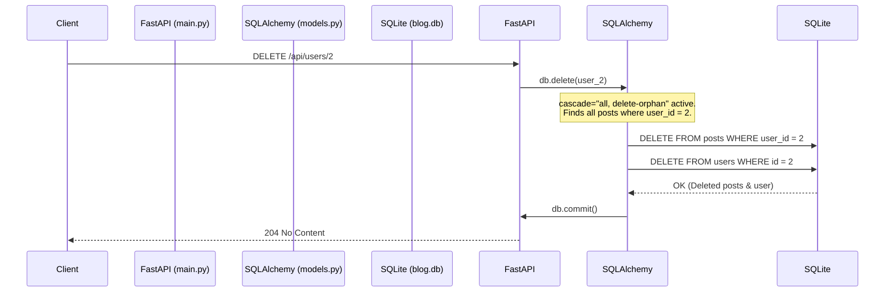

# CRUD Operations & Cascade Delete in FastAPI & SQLAlchemy

This document explains the CRUD (Create, Read, Update, Delete) operations implemented in this application, how they map to HTTP methods and database actions, and how **Cascade Delete** works to maintain database integrity.

---

## 1. What is CRUD?

**CRUD** is an acronym representing the four basic operations needed to manage persistent data storage:

| Operation | Description | HTTP Method | FastAPI Route Example | SQL Command |
| :--- | :--- | :--- | :--- | :--- |
| **C**reate | Adds new records to the database. | `POST` | `POST /api/posts` | `INSERT INTO ...` |
| **R**ead | Retrieves records from the database. | `GET` | `GET /api/posts/{post_id}` | `SELECT ...` |
| **U**pdate | Modifies existing database records. | `PUT` / `PATCH` | `PATCH /api/posts/{post_id}` | `UPDATE ...` |
| **D**elete | Removes records from the database. | `DELETE` | `DELETE /api/posts/{post_id}` | `DELETE FROM ...` |

---

## 2. CRUD Implementation in this Project

Here is how the CRUD operations are split between your **User** and **Post** resources in [main.py](file:///c:/Users/balaj/Pictures/FASTAPI-deep/main.py):

### User CRUD
* **Create**: `POST /api/users`
  * Validates that username/email are unique.
  * Adds new `User` to database.
* **Read**:
  * `GET /api/users/{user_id}`: Retrieves profile details.
  * `GET /api/users/{user_id}/posts`: Retrieves all posts written by this user.
* **Update (Partial)**: `PATCH /api/users/{user_id}`
  * Dynamically updates specified user fields (e.g., username, email, or profile picture).
* **Delete**: `DELETE /api/users/{user_id}`
  * Deletes a user from the system (triggers cascade delete for their posts).

### Post CRUD
* **Create**: `POST /api/posts`
  * Checks if the author `user_id` exists, then creates the post.
* **Read**:
  * `GET /api/posts`: List of all posts.
  * `GET /api/posts/{post_id}`: Fetch a specific post.
* **Update (Full & Partial)**:
  * `PUT /api/posts/{post_id}`: Replaces title, content, and owner.
  * `PATCH /api/posts/{post_id}`: Partially updates only the title or content.
* **Delete**: `DELETE /api/posts/{post_id}`
  * Deletes a single post from the system.

---

## 3. Explain Cascade Delete

### What is Cascade Delete?
In a relational database, tables are linked together using **Foreign Keys**. In this project:
- A `Post` belongs to a `User`.
- The `posts` table has a `user_id` column which references `users.id` (Foreign Key).

If a `User` is deleted, what happens to their posts? If they remain in the database, they will have a `user_id` pointing to a user that no longer exists. These are called **orphaned records**, and they violate **Referential Integrity**.

**Cascade Delete** is a rule that automatically deletes all child records (posts) when their parent record (user) is deleted.

### How it is configured in this project
In [models.py](file:///c:/Users/balaj/Pictures/FASTAPI-deep/models.py), you have configured this on the `User` model using SQLAlchemy's relationship `cascade` argument:

```python
class User(Base):
    __tablename__ = "users"
    
    # ... other columns ...
    
    posts: Mapped[list[Post]] = relationship(
        back_populates="author",
        cascade="all, delete-orphan"  # <--- HERE
    )
```

#### Meaning of `cascade="all, delete-orphan"`:
1. **`all` (specifically `save-update, merge, refresh-expire, expunge, delete`)**: 
   - When a parent (`User`) object is marked for deletion via `db.delete(user)`, SQLAlchemy automatically marks all related child (`Post`) objects in the `.posts` list to be deleted as well.
2. **`delete-orphan`**:
   - If you remove a post from a user's `posts` collection (e.g. `user.posts.remove(some_post)`), SQLAlchemy will delete `some_post` from the database because it has been "orphaned" (disassociated from its parent user).

---

### Step-by-Step Execution of Cascade Delete

Let's look at what happens under the hood when `DELETE /api/users/{user_id}` is called:



1. **Delete User Request**: A request is received to delete a User with ID `2`.
2. **SQLAlchemy Check**: SQLAlchemy loads the User. Because of `cascade="all, delete-orphan"`, SQLAlchemy also loads all Posts where `user_id == 2`.
3. **Execution**: SQLAlchemy executes two DELETE queries:
   ```sql
   DELETE FROM posts WHERE user_id = 2;
   DELETE FROM users WHERE id = 2;
   ```
4. **Result**: Both the user and all their blog posts are cleanly deleted, leaving no orphaned data behind.
